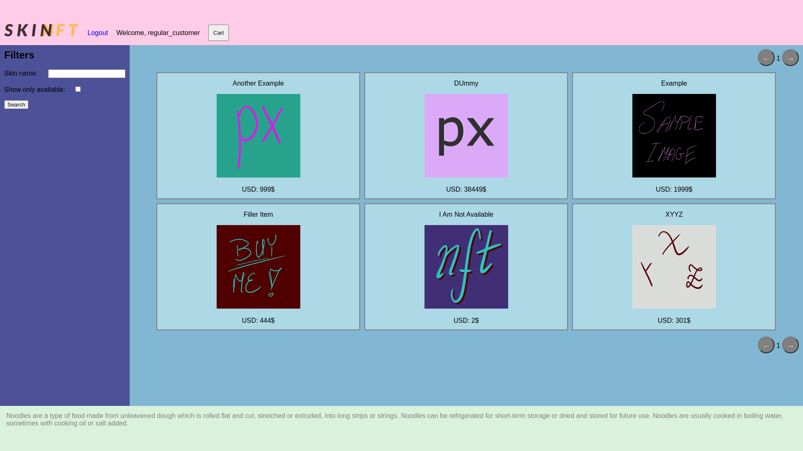

# SKINFT Online Shop

### A full-stack team project built using Node.js, Express.js, and MongoDB

<!--  -->


###### Authors are aware that the front-end is not the strongest point of this project, however it was never meant to be.

## Features

### Functionalities
- anonymous user:
    - browsing items
    - simple filtering: by name, by availability
- registration:
    - unique username
    - password (with encrypted storage)
    - other info
- registered user:
    - log in & out
    - add & remove items from the cart
    - check out & place an order
- administrator:
    - admin page with special functionalities
    - insert & delete items from the offer
    - modify existing items
    - view users & orders
- session management

### Implementation
- 2 separate Docker containers with fully automated setup, running the website, and the database
- NoSQL database MongoDB integrated with Node.js by Mongoose ORM
- document schemas in MongoDB
- Express.js server with multiple endpoints, session management & file uploading
- use of templates to render the front-end

## Running

### Prerequisites
- Docker and Docker Compose
- Docker Service started
- this repository downloaded

### Building & Starting
In the root of this repository on your local machine execute:  
  
```docker compose up [-d]```  
  
`-d` option runs the set of containers in the detached mode.
  
It's advisable to wait a couple of seconds to give the containers time to set up properly (possible a little longer, if the images need to be downloaded beforehand).  
Then, the service is available at `http://localhost:3000`.

### Usage

There are existing accounts, to which you can log in and explore their functionalities:
- administrator:
    - username: `adminft`
    - password: `adminft`
- customer:
    - username: `regular_customer`
    - password: `iamregular`

Initially, the shop contains 7 sample items, 6 per page, and 1 placed order.

### Shutting down

In the root of this repository execute:  
  
```docker compose down```
